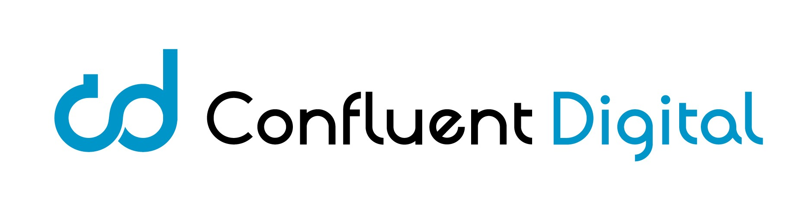

# 

# 🚀 Confluent Digital

**Confluent Digital** est une agence de communication digitale basée à Lyon 🌍, spécialisée dans l'accompagnement des entreprises françaises et internationales. Experts en **Inbound Marketing** et **Outbound Marketing**, nous proposons des solutions innovantes pour optimiser la présence en ligne de nos clients, générer des leads qualifiés, accroître leur visibilité, augmenter le trafic web, et booster les ventes 📈.

### 🎯 Notre mission

Notre mission est d'accompagner les annonceurs dans la création et l'exécution de stratégies webmarketing performantes et adaptées à leurs objectifs spécifiques 🎨. Qu'il s'agisse d'améliorer la notoriété de marque, d'augmenter le trafic web, de générer des contacts qualifiés ou de fidéliser les clients, nous mettons en œuvre des leviers digitaux puissants pour des résultats mesurables ⚙️.

### 💡 Nos expertises

- **Stratégie Webmarketing :** 🔍 Conseil personnalisé pour répondre à vos objectifs de notoriété, d'acquisition, ou de conversion.
- **Inbound Marketing :** 🎯 Attirer et convertir des prospects qualifiés grâce à du contenu pertinent et optimisé.
- **Outbound Marketing :** 📤 Cibler et atteindre efficacement votre audience à travers des campagnes publicitaires et d'e-mailing.
- **SEO / SEM :** 🔗 Optimisation pour les moteurs de recherche et gestion des campagnes publicitaires sur Google Ads et autres plateformes.
- **Social Media Marketing :** 📱 Gestion de vos réseaux sociaux pour accroître votre audience et votre engagement.
- **Marketing Automation :** 🤖 Automatisation des processus marketing pour améliorer la gestion des leads et la conversion.

### ⭐ Pourquoi choisir Confluent Digital ?

Chez Confluent Digital, nous croyons en l'approche personnalisée pour répondre aux besoins uniques de chaque client 🏆. Nous sommes passionnés par la **création de valeur** à long terme pour nos partenaires, et nous utilisons une combinaison de technologies de pointe, d'analyses précises et de créativité pour garantir des résultats concrets 🧠.

Nous accompagnons déjà de nombreux annonceurs sur leurs campagnes de **référencement naturel (SEO)**, **publicité en ligne (SEA)**, **réseaux sociaux** et **création de contenu**, en France 🇫🇷 comme à l'international 🌐.

### 🤝 Rejoignez-nous !

Découvrez comment **Confluent Digital** peut transformer votre présence digitale et vous aider à atteindre vos objectifs marketing 🎯.

# 📞 Contactez-nous

- 🌐 [Visitez notre site web](https://www.confluent-digital.com) pour en savoir plus sur nos services.
- 💼 Suivez-nous sur [LinkedIn](https://www.linkedin.com/company/confluent-digital) pour des mises à jour professionnelles.
- 🔵 Retrouvez-nous sur [Facebook](https://www.facebook.com/confluentdigital) pour les dernières actualités.

Vous avez des questions ou un projet à discuter ? **Contactez-nous dès aujourd'hui !**
